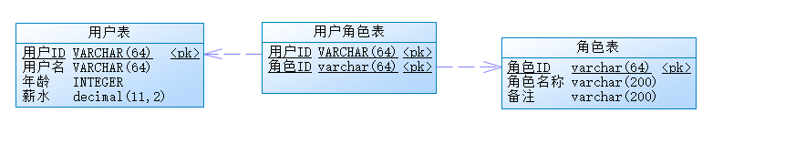

# Mybatis扩展

本人在Mybatis使用过程中，曾经做过一系列的扩展，有的是简化配置，有的是扩展功能，现将这些扩展整理出来，一是对之前工作的一个总结，再则，也希望可以给有需要的朋友一些参考。

## 运行环境

*项目使用了H2作为测试数据库，可以不做任何修改即可运行测试用例*

* 编译、运行环境：JDK 8 + Maven 3 + IDEA + Lombok
* spring-boot：2.1.0.RELEASE(Spring：5.1.2.RELEASE)
* mybatis-spring-boot：2.1.0(Mybatis：3.5.2)
> 具体依赖可查看pom.xml

## 业务场景

一方面，对于Mybatis来说，`Hello World`并不足以演示Mybatis的功能和扩展；另一方面，DAO的实际业务场景非常多，选取这些业务场景也比较为难，太简单了，展示不了典型应用，太专业了，又不够通用，还增加理解的难度。因此，为了更好的展示Mybatis的功能和扩展，也为了将注意力更加集中到Mybatis本身，我提取了一个比较典型也比较好理解的业务场景：

每一个企业应用，基本上都会有权限控制，而最常见的莫过于基于角色的权限控制（Role-Based Access Control，缩写RBAC），最基本的RBAC（RBAC0级）有用户、角色、权限以及用户角色、角色权限的关联。我们取其中的用户、角色、用户角色关系作为这一系列扩展的业务场景。



### 主要业务操作

* 查询列表
   1. 根据条件查询一组数据
* 查询列表（分页）
   1. 根据条件查询一组数据
* 查找
   1. 根据主键查找一条记录（0或1）   
* 增加用户：
   1. 插入用户表（一条）
   1. 插入用户关系表（一组，可以是0或n）
* 修改用户：
   1. 修改用户表（一条)
   1. 删除用户关系表（根据用户ID删除一组）
   1. 插入用户关系表（一组，可以是0或n）
* 批量删除用户
   1. 删除一组用户
   1. 删除每个用户的用户角色关系

### 建表语句
> 以MySQL为例，H2、Oracle等可以直接查看项目中的SQL脚本（目录：classpath:/META-INF/sql/)
```sql
/*==============================================================*/
/* Table: PF_USER                                               */
/*==============================================================*/
DROP TABLE IF EXISTS PF_USER;
CREATE TABLE PF_USER
(
  USER_ID   VARCHAR(64) NOT NULL COMMENT '用户ID',
  USER_NAME VARCHAR(64) COMMENT '用户名',
  AGE       INTEGER COMMENT '年龄',
  SALARY    DECIMAL(11,2) COMMENT '薪水',
  PRIMARY KEY (USER_ID)
);
ALTER TABLE PF_USER COMMENT '用户表';


/*==============================================================*/
/* Table: PF_ROLE                                               */
/*==============================================================*/
DROP TABLE IF EXISTS PF_ROLE;
CREATE TABLE PF_ROLE
(
  ROLE_ID   VARCHAR(64)  NOT NULL COMMENT '角色ID',
  ROLE_NAME VARCHAR(200) NOT NULL COMMENT '角色名称',
  DES       VARCHAR(200) COMMENT '备注',
  PRIMARY KEY (ROLE_ID)
);
ALTER TABLE PF_ROLE COMMENT '角色表';


/*==============================================================*/
/* Table: PF_USER_ROLE                                          */
/*==============================================================*/
DROP TABLE IF EXISTS PF_USER_ROLE;
CREATE TABLE PF_USER_ROLE
(
  USER_ID VARCHAR(64) NOT NULL COMMENT '用户ID',
  ROLE_ID VARCHAR(64) NOT NULL COMMENT '角色ID',
  PRIMARY KEY (USER_ID, ROLE_ID)
);
ALTER TABLE PF_USER_ROLE COMMENT '用户角色表';
```

说明几点：
* 虽然截图中有关系箭头，但是为了简化，没有使用外键
* 为了数据类型的多样性，在用户表中添加了年龄(age,整型)、薪水(salary,数字类型)
* 因为不方便移植的原因，个人不建议使用自增类型和时间戳类型，所以没有添加这两种

### 初始化数据

初始数据如下：
* 2个角色
   * admin 管理员
   * visitor 游客
* 2个用户
   * 张三，管理员
   * 李四，游客
```sql
-- ----------------------------
-- Records of pf_user
-- ----------------------------
INSERT INTO `pf_user`(`USER_ID`, `USER_NAME`, `AGE`, `SALARY`)VALUES ('1', '张三', 35, 50000.00);
INSERT INTO `pf_user`(`USER_ID`, `USER_NAME`, `AGE`, `SALARY`)VALUES ('2', '李四', 26, 20000.00);

-- ----------------------------
-- Records of pf_role
-- ----------------------------
INSERT INTO `pf_role`(`ROLE_ID`, `ROLE_NAME`, `DES`)VALUES ('admin', '管理员', '拥有最大权限');
INSERT INTO `pf_role`(`ROLE_ID`, `ROLE_NAME`, `DES`)VALUES ('visitor', '游客', '最低权限');

-- ----------------------------
-- Records of pf_user_role
-- ----------------------------
INSERT INTO `pf_user_role`(`USER_ID`, `ROLE_ID`)VALUES ('1', 'admin');
INSERT INTO `pf_user_role`(`USER_ID`, `ROLE_ID`)VALUES ('2', 'visitor');
```
